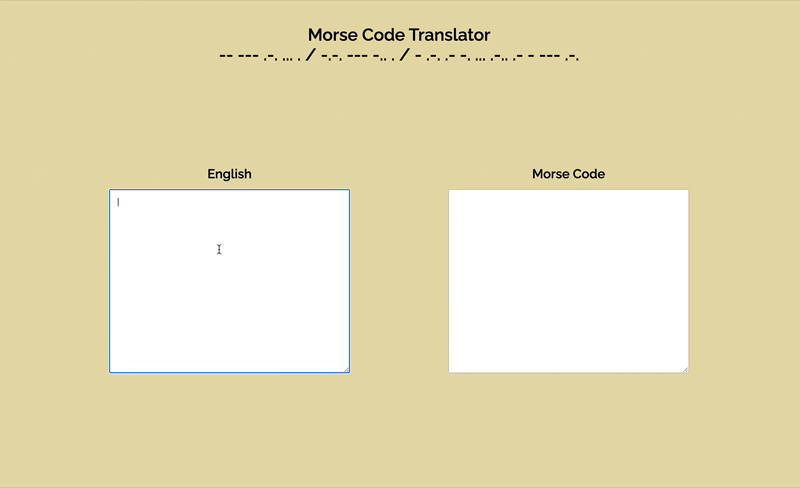

# Morse Code Translator

> _A web-based programme made using an OOP approach that converts English to Morse Code and back again based on user input. It includes two classes, an English -> Morse Code translator class and a Morse Code -> English translator class, which, when fed a library of equivalent alphabets, include all the information and methods necessary for translating between the two alphabets._</br>

Project link [_here_]()

<p align="center">
  
</p>

The translator is case insensitive, thus “sos” should produce same output as “SOS” (“••• −−− •••”). When translating Morse Code to English, the output is uppercased, thus “••• −−− •••” translated into English outputs “SOS”.

## Approach

1. Following TDD principles, my first task was to write a series of tests for the two classes in the application, an English to Morse Code Translator class and a Morse Code to English Translator class, as well as their shared and respective methods.

2. My next task was to make an 'EngToMorseCodeTranslator' class, which featured two methods necessary to translate English to Morse Code and return the result as HTML to display: translateEngToMorseCode(str) and getTranslationHTML(value).

3. In order to replicate this process in reverse, I then extended the above class to make a 'MorseCodeToEngTranslator' equivalent. This class, however, required further methods so that it could handle the same alphabetic input and return the appropriate HTML. It first needed to convert the alphabet passed to it into a mirror of the original data in terms of key–value pairs. I acheived this by swapping the key–value pairs of the objects in question in the 'alphabet' data, which came in the form of an array of objects:

```javascript
swapAlphabet() {
  this.alphabetArr = this.alphabetArr.map((alphabet) => {
    const swapKeysAndValues = (obj) => {
      const swapped = Object.entries(obj).map(([key, val]) => [val, key]);
      return Object.fromEntries(swapped);
    };
    return swapKeysAndValues(alphabet);
  });
}
```

4. Further methods were required in this second class to provide error messages and instructions depending on the user's correct or incorrect code input and to handle spaces and specific Morse Code formatting.

5. I then added two event listeners set up to detect user inputs to two seperate textarea elements via query selectors to ensure that when a user typed into a textarea, the equivalent English or Morse Code was displayed in the other one in real time (see gif above).

## Technologies & Features:

- Vanilla JavaScript
- OOP approach
- Unit-tested using Jest
- HTML5
- CSS/SCSS
- Mobile first / responsive design
- Git Version Control

## Further Developments:

- Update styles
- Seperate classes and DOM elements into different files
- Add option to change input alphabet
- Alternatively, enable the input to be in any alphabet (i.e. include multiple alphabets in the library)
